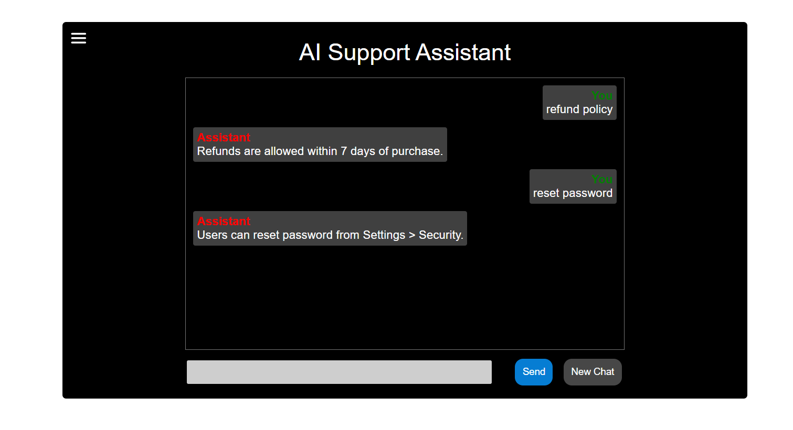
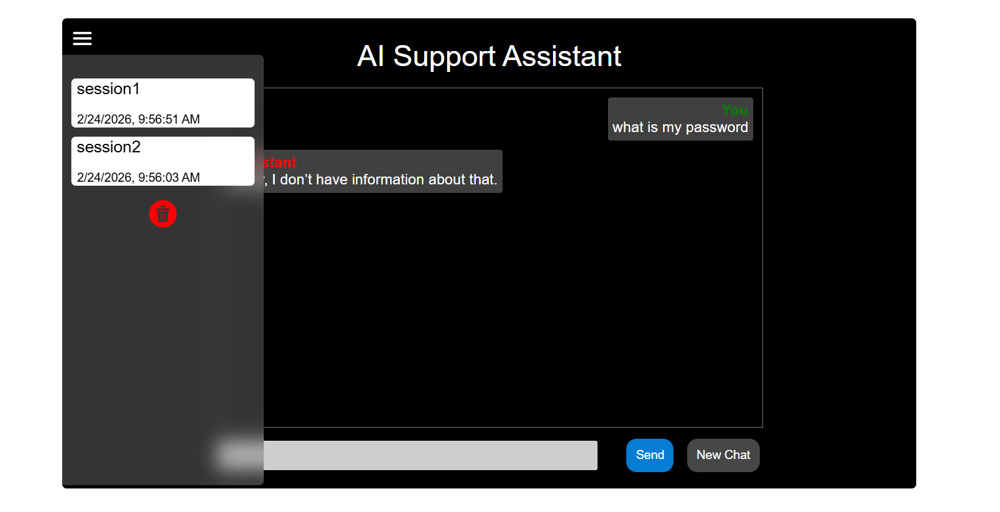
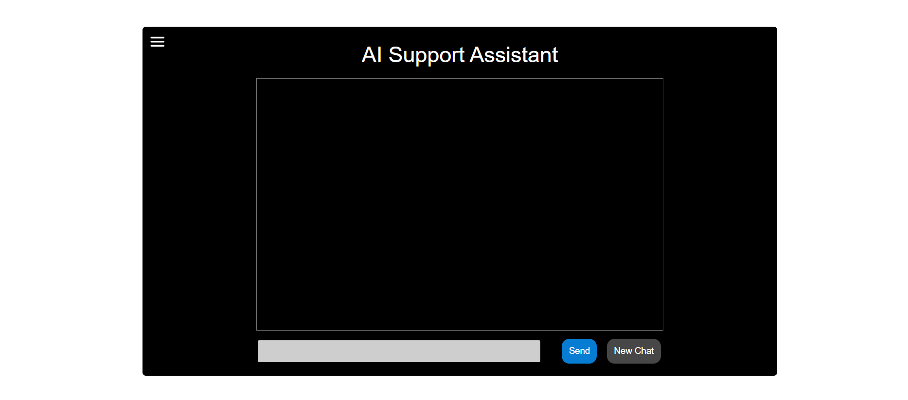
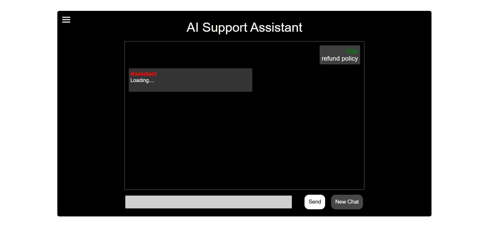

# AI Support Assistant -- Document-Restricted Chatbot

A full-stack AI-powered support assistant that answers user queries
strictly using provided documentation.

------------------------------------------------------------------------

## Tech Stack

Frontend: - React - Axios

Backend: - Node.js - Express.js - SQLite3 - Gemini API

------------------------------------------------------------------------

## Project Structure

root/
├── frontend/ \# React application\
├── backend/ \# Express server + SQLite\
├── .env.example\
└── README.md

------------------------------------------------------------------------

## Setup Instructions

### 1. Clone Repository

git clone `<your-repo-url>`{=html}\
cd `<repo-name>`{=html}

------------------------------------------------------------------------

### 2. Backend Setup

cd backend\
npm install

Create a .env file inside backend:

GEMINI_API_KEY=your_gemini_api_key_here

Start backend:

npm start

Backend runs on:\
http://localhost:5000

------------------------------------------------------------------------

### 3. Frontend Setup

cd frontend\
npm install\
npm start

Frontend runs on:\
http://localhost:3000

------------------------------------------------------------------------

## Environment Variables

Create a file named `.env.example` in root:

GEMINI_API_KEY=your_gemini_api_key_here

------------------------------------------------------------------------

## API Documentation

### POST /api/chat

Request Body: { "sessionId": "string", "message": "string" }

Response: { "reply": "AI response", "tokensUsed": 0 }

------------------------------------------------------------------------

### GET /api/conversations/:sessionId

Returns full conversation in chronological order.

------------------------------------------------------------------------

### GET /api/sessions

Returns list of sessions ordered by latest activity.

------------------------------------------------------------------------

### DELETE /api/sessions

Deletes all sessions and messages.

------------------------------------------------------------------------

## Database Schema

### sessions table

-   id (TEXT, Primary Key)\
-   created_at (DATETIME)\
-   updated_at (DATETIME)

### messages table

-   id (INTEGER, Primary Key)\
-   session_id (TEXT, Foreign Key)\
-   role (TEXT: user / assistant)\
-   content (TEXT)\
-   created_at (DATETIME)

------------------------------------------------------------------------

## LLM Integration

-   Model: gemini-2.5-flash\
-   Documentation injected into prompt\
-   Strict fallback if answer not found

Fallback message: Sorry, I don't have information about that.

------------------------------------------------------------------------

## Assumptions

-   Single user system\
-   SQLite used for lightweight persistence\
-   No authentication implemented

------------------------------------------------------------------------

## 📷 Screenshots

### Chat Interface

### Session List

### New Chat View

### New Chat View

## Author
Venkata Sai Gunda
